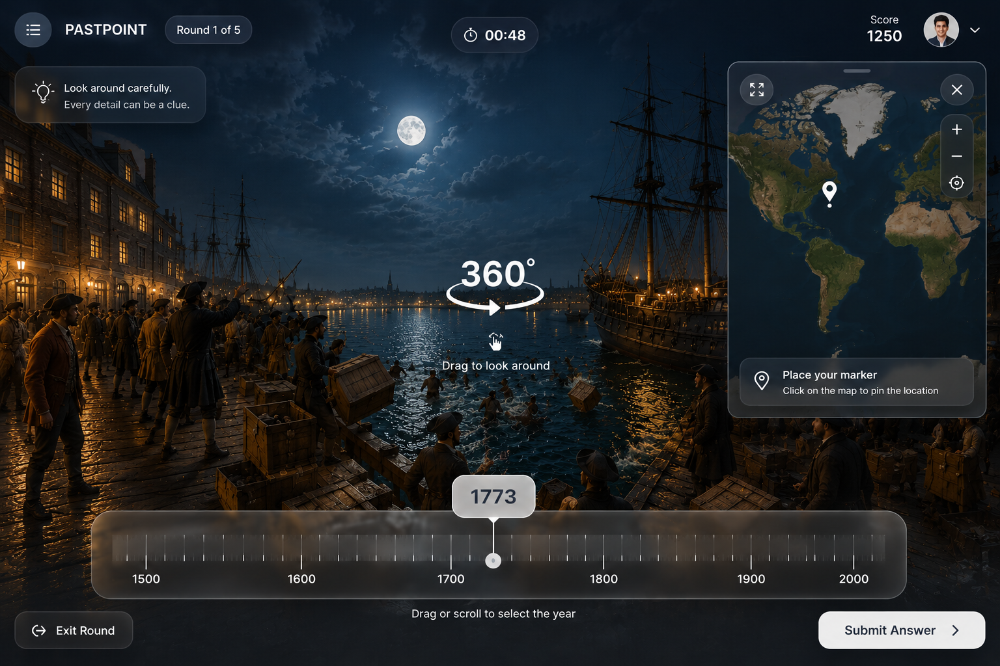

# PastPoint

## Концепция

PastPoint — иммерсивная историческая игра в формате GeoGuessr. Вместо современной улицы игрок оказывается внутри панорамной реконструкции исторического события, осматривает окружение и пытается определить:

- что происходит;
- в каком году это произошло;
- где это произошло.

Главное отличие от обычной викторины: игрок не отвечает на вопрос по тексту, а самостоятельно исследует сцену и делает вывод по визуальным деталям — одежде, архитектуре, транспорту, предметам и окружению.

## Короткий pitch

> **PastPoint is a GeoGuessr-style history game where players explore AI-created historical scenes and determine what happened, where, and when.**

## Основной игровой цикл

1. Игрок попадает в полноэкранную 360°-сцену с одной фиксированной точки обзора.
2. Осматривает панораму с помощью мыши, touch-жестов или trackpad.
3. Вручную вводит название события без вариантов ответа.
4. Выбирает год с помощью горизонтальной крутилки.
5. Ставит маркер на интерактивной карте.
6. Нажимает `Submit Answer`.
7. Получает правильное событие, год, место и короткое AI-сгенерированное объяснение того, как сцену можно было определить.

На первом этапе очки не рассчитываются. Игра сохраняет только фактический результат:

- правильно ли указано событие;
- насколько отличается выбранный год;
- как далеко поставлен маркер.

Система очков, соревнования и лидерборды появятся позднее.

## Целевой дизайн

Из референса сохраняются:

- историческая сцена на весь экран;
- минимальный тёмный интерфейс поверх панорамы;
- логотип и номер раунда слева сверху;
- таймер по центру;
- небольшая интерактивная карта справа сверху;
- крупная горизонтальная шкала года снизу;
- основная кнопка отправки справа снизу;
- стеклянные полупрозрачные панели;
- короткая подсказка по управлению 360° при первом запуске.

Из текущего MVP исключаются Score и профиль пользователя. Поле ручного ввода события размещается слева над шкалой года. Постоянная маркировка AI-реконструкции в игровом интерфейсе не используется.

## Роль AI

AI не выступает чат-ботом внутри игры. Он используется как система производства исторических заданий.

### Scene Director

LLM получает историческое событие и подготовленные источники, после чего создаёт структурированный blueprint:

- место и время действия;
- положение камеры;
- обязательные элементы сцены;
- недопустимые исторические детали;
- визуальные признаки события;
- допустимые названия события;
- текст объяснения после ответа.

### Panorama Generator

Специализированная image-модель превращает blueprint в сферическую equirectangular-панораму. Сцена генерируется заранее, проверяется и только после этого добавляется в игру.

### Game Content

LLM также подготавливает:

- правильные данные события;
- варианты допустимого написания ответа;
- краткое объяснение того, как определить событие;
- будущие настройки сложности.

AI не оценивает свободный ответ во время текущего MVP. Название события проверяется локально по нормализованному списку допустимых ответов.

## Первый vertical slice: Boston Tea Party

- Событие: Boston Tea Party.
- Дата: 16 декабря 1773 года.
- Место: Griffin's Wharf, Boston, Massachusetts.
- Сцена: Бостонская гавань ночью, деревянный причал, торговые парусные корабли XVIII века, колонисты и ящики с чаем, сбрасываемые в воду.

Игровые данные:

- правильный год: `1773`;
- приблизительные координаты: `42.3515, -71.0514`;
- допустимые ответы:
  - `Boston Tea Party`;
  - `The Boston Tea Party`;
  - `Бостонское чаепитие`.

После отправки ответа игрок видит короткое объяснение:

> The tea chests, colonial merchant ships, nighttime harbor setting, and eighteenth-century clothing point toward the Boston Tea Party, which took place in Boston on December 16, 1773.

Отдельные hotspot-подсказки, автоматическое вращение камеры к уликам и визуальная разметка объектов пока не используются.

## Границы MVP

В первой рабочей версии есть:

- один исторический раунд;
- одна 360°-панорама;
- ручной ввод события;
- крутилка года;
- интерактивная карта;
- отправка ответа;
- результат и AI-объяснение;
- повторный запуск раунда.

В первой версии нет:

- очков;
- вариантов ответа;
- аккаунтов;
- профилей;
- лидерборда;
- realtime multiplayer;
- перемещения между точками;
- 3D, VR и NPC;
- генерации панорамы во время игры;
- отдельного backend или базы данных.

## Будущее развитие

После завершения Boston Tea Party vertical slice:

1. Добавить ещё несколько тщательно проверенных событий.
2. Создать Classic и Expert режимы.
3. Ввести единый расчёт очков по событию, времени и расстоянию.
4. Добавить одинаковые daily-наборы для всех игроков.
5. Реализовать комнаты друзей и лидерборды.
6. Соединить несколько панорам одного события в исторический маршрут.
7. Создать внутренний Scene Studio для генерации и проверки нового контента.

## Принципы продукта

- Сначала исследование сцены, затем ответ.
- Минимум интерфейса во время осмотра.
- AI создаёт контент, но не отвлекает игрока чат-интерфейсом.
- Сцены проходят ручную проверку перед публикацией.
- Историческая правдоподобность важнее количества сцен.
- Один законченный игровой раунд важнее большого незавершённого каталога.
